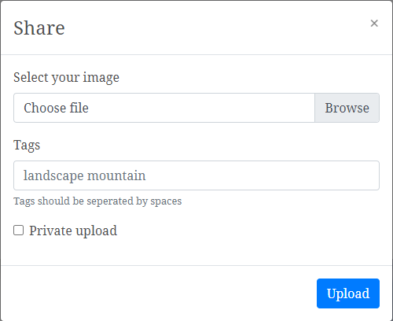

    

---

An image repository 🖼️ created using React and Google Firebase.

## Contents 📦
1. [Basic Usage](#basic-usage)
    1. [Viewing](#viewing)
    2. [Sharing](#sharing)
2. [Authentication](#auth)

## Basic Usage <a name="basic-usage">

---
### Viewing <a name="viewing">
While not logged in, users can freely view public uploads from other users. 

### Sharing <a name="sharing">
Logged in users can upload pictures (one by one or bulk) by clicking the ➕ button located immediately beneath the greeting line. 

    

Then, users can select local file(s) that they wish to share, and optionaly include tags or make the upload private to other users. 

The Images will then be saved into Google Firebase Storage and their associate meta-info (such as urls to Firebase Storage, creation time, author info, etc) will be stored into Google Firebase Firestore in real-time, so that other users' home pages will be updated immediately. 

    

## Authentication <a name="auth">

---
Basic authentication can be controled by various buttons located at the right part of the navigation bar, including "Sign Up" and "Log In" when users are not logged in and "Log Out" when users are already logged in. 

All authentication are stored in Google Firebase Auth with user profiles that store users' display names. 
